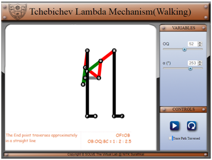

1. OQ is the varied to increase stroke length

2. The trace check box is used to trace the path followed by the leg

3. Speed of walking can be increased by increasing the input angular velocity

**Simulation**

<ul>
  <li>In this page the link lengths can be varied proportionally by increasing OQ</li>
  <li>The Path traced by the leg can be checked by checking the Trace option</li>
  <li>The simulation has two modes
    <ul style="list-style-type: circle">
      <li> <strong>Pause Mode</strong>: In this mode the simulation is made to behave in such a way that the user inputs the input angle. In the screenshot displayed above the simulation is paused and the user can vary alpha values accordingly as per his/her wish</li>
      <li> <strong>Run Mode</strong>: In this mode the simulation is made to behave in such a way that the user inputs the angular velocity of the four bar linkage.</li>
    </ul>
  </li>
</ul>

Overall this screen of the simulation is used figure out the application of the four bar mechanism as a walking mechanism
