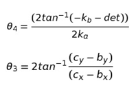

## Objective

After completing the experiments on Tchebichev’s Lambda Mechanism

- Students will be able to understand the application of four bar mechanism is walking mechanism

## Prerequisites

Please go through the theory of the kinematic analysis of the four bar linkage before attempting this experiment

## Theory

The Tchebyshev's Lambda Mechanism is a four-bar mechanism that converts rotational motion to approximate straight-line motion with approximate constant velocity. The precise design trades off straightness, lack of acceleration, and the proportion of the driving rotation that is spent in the linear portion of the full curve.

The Tchebyshev's Lambda Mechanism is a cognate linkage of the Tchebyshev linkage.

The linkage was first shown in Paris on the Exposition Universelle (1878) as "The Plantigrade Machine".

The Tchebyshev's Lambda Mechanism looks like the Greek letter lambda, therefore the linkage is also known as Lambda Mechanism.

**R1, R2,R3,R4 are lengths of link OQ, link OB, link BD and link CQ respectively**

R1=R2÷2

R3=2.5×R2

R4=2.5×R2

k=(R22-R32+R42+R12)÷2

ka=k-R2(R1-R4)cos(BOQ)-(R4R1)

kb=-2R2(R4)sin(BOQ)

kc=k-R2(R1+R4)cos(BOQ)-(R4R1)

det=kb2-4kakc

Positions are found using the angles above with the given link lengths
